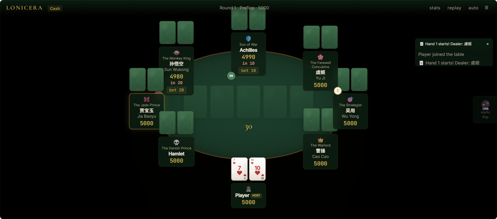
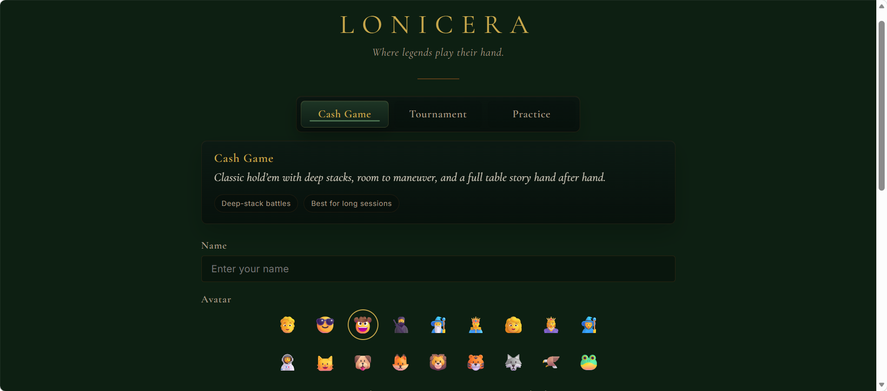

# LONICERA: A Poker Game

A self-hosted multiplayer Texas Hold'em poker game with 22 AI opponents inspired by characters from classic literature and history.

Built for home servers and NAS devices. No accounts, no ads, no tracking — just poker.




## ✨ Features

**Three Game Modes**

- 💰 **Cash Game** — Classic mode with rebuyable chips, supports multiplayer
- 🏆 **Tournament** — Escalating blinds, elimination format
- 🎓 **Practice** — Solo mode with free real-time equity display, speed control, and pause

**22 Literary & Historical NPC Opponents**

Characters from _Journey to the West_, _Romance of the Three Kingdoms_, _Water Margin_, _Dream of the Red Chamber_, Shakespeare, Homer's Epics, and the Chu-Han Contention — each with distinct play styles, psychology, and table talk.

| Style      | Characters                                 |
| ---------- | ------------------------------------------ |
| Maniac     | Sun Wukong, Lu Zhishen, Achilles, Xiang Yu |
| Aggressive | Cao Cao, Zhao Yun, Macbeth, Fan Zeng       |
| Balanced   | Zhuge Liang, Lin Chong, Han Xin            |
| Tricky     | Wu Yong, Wang Xifeng, Odysseus, Liu Bang   |
| Tight      | Tang Seng, Guan Yu, Zhang Liang            |
| Passive    | Jia Baoyu, Hamlet, Yu Ji                   |

**AI Decision Engine**

- Monte Carlo equity simulation (3,000+ iterations)
- Preflop lookup table (169 hand types × 7 opponent counts × 10,000 sims)
- Opponent modeling & range estimation
- Multi-street strategic planning
- Psychology system: tilt, revenge, confidence, gear-shifting
- NPC table talk driven by emotional state

**Solver-Assisted Postflop Play**

- Supports normalized postflop solver runtime trees in validated heads-up spots
- Current validated runtime spot: `BTN_vs_BB / SRP / 50bb`
- Solver decisions are only applied in supported contexts and fall back cleanly everywhere else
- Offline tooling for script generation, workload slicing, normalization, import, retry, and runtime verification is included in the repository
- Solver workload generation and runtime integration are built with thanks to the open-source [TexasSolver](https://github.com/bupticybee/TexasSolver) project

**🔮 Equity Oracle**

- **Practice mode**: Free real-time equity with hand labels, outs, and delta tracking
- **Cash/Tournament**: Pay-per-use with escalating cost (3 free, then 1BB → 2BB → 4BB → ...)
- Range-weighted Monte Carlo — factors in opponent behavior, not just random hands
- Smart hand labeling: distinguishes board pairs from made hands
- Detects flush draws, straight draws, and combo draws

**Other Features**

- Hand replay & full action history
- Leaderboard tracking
- Host-only room controls
- Ready check for multiplayer cash/tournament rooms
- Session-token reconnection
- Save/load game state
- Tournament with auto-escalating blinds
- Mobile-friendly responsive UI
- In-game name change
- Mid-game spectator join

## 🚀 Quick Start

### Published Container Image

```bash
docker pull ghcr.io/billwang0101/lonicera:latest
docker run -d -p 2026:2026 --restart unless-stopped --name lonicera ghcr.io/billwang0101/lonicera:latest
```

Open `http://localhost:2026` in your browser. Done.

GitHub Container Registry image names are lowercase even if the repository name uses uppercase letters.

### Docker Compose From Source

```bash
git clone https://github.com/BillWang0101/LONICERA.git
cd lonicera
docker compose up -d
```

If Docker builds are slow on a NAS or private network, point the build at a closer npm mirror first:

```bash
export NPM_REGISTRY=https://registry.npmmirror.com
docker compose up -d --build
```

For private NAS or home-server deployments where the checkout is only a build copy, the most reliable update flow is to force-align the worktree to `origin/main` before rebuilding:

```bash
cd /path/to/lonicera-deploy

sudo docker run --rm \
  --entrypoint sh \
  -v "$PWD":/repo \
  -w /repo \
  alpine/git \
  -lc 'git config --global --add safe.directory /repo && \
       git fetch origin main && \
       git reset --hard origin/main && \
       git clean -fd && \
       git rev-parse --short HEAD'

sudo NPM_REGISTRY=https://registry.npmmirror.com docker compose up -d --build
```

This intentionally discards uncommitted changes in the NAS checkout and makes the deploy copy match the remote exactly.

### Build from Source

```bash
git clone https://github.com/BillWang0101/LONICERA.git
cd lonicera
docker build -t lonicera .
docker run -d -p 2026:2026 --restart unless-stopped --name lonicera lonicera
```

### Run Locally (Node.js 18+)

```bash
npm install
node server.js
```

Open [http://localhost:2026](http://localhost:2026).

## 🎯 How It Plays

### Cash Game

1. Enter a name, room, stack, blind, and optional NPC count.
2. Join the table with `Take a Seat`.
3. In multiplayer human rooms, each human can toggle `Ready`.
4. The room host starts the first hand with `Deal`.

### Tournament

1. Join a room the same way.
2. The room host starts with `Start Tournament`.
3. Blinds escalate automatically until one player remains.

### Practice

1. Switch to `practice`.
2. Start immediately against AI opponents.
3. Use speed control, pause, and free real-time equity.

## 🏠 Room Rules

- The first human to join becomes the room host.
- Host-only actions: `Deal`, `Start Tournament`, `Next Hand`, NPC add/remove, save, delete save, restart.
- If the host disconnects, host ownership is preserved briefly for reconnection, then handed to an online human player.
- Multiplayer cash/tournament rooms use a lightweight ready check before the first hand.
- NPCs never participate in ready check.
- The host can still force-start if some human players are not ready.

## 💾 Saves And Reconnects

- Saves are room-based, not account-based.
- Only the room host can save or delete a room save.
- Saves are only allowed between hands, not mid-hand.
- Reconnection uses a session token stored in local browser storage for that room.
- Rejoining by name alone is not accepted as a reconnect path.

## 🖥️ NAS / Home Server Notes

- Plain HTTP on a LAN is supported.
- The server does **not** force HTTPS.
- No `Strict-Transport-Security`, `upgrade-insecure-requests`, or Helmet-style HTTPS enforcement is enabled by default.
- This is intentional so common NAS and reverse-proxy setups keep working without CSS or asset failures.

## 🧠 Solver Deployment Notes

- LONICERA already includes solver integration code and runtime lookup helpers.
- Full solver runtime data does **not** live in Git.
- The current validated runtime spot is:
  - `BTN_vs_BB / SRP / 50bb`
  - `1755 / 1755` flops complete
- The application expects:
  - `data/solver/trees/BTN_vs_BB/SRP_50bb`
  - to contain the complete runtime tree mounted into the container
- Runtime data should be stored outside Git and mounted into the container.
- Root-cache data is optional but recommended for fast exact-hit lookup.

Recommended Docker Compose setup:

```bash
export SOLVER_DATA_DIR=/path/to/lonicera/solver-workloads/phase1-btn-vs-bb-srp-50bb-full/runtime
export SOLVER_ROOT_CACHE_DIR=/path/to/lonicera/solver-workloads/phase1-btn-vs-bb-srp-50bb-full/root-runtime-cache
docker compose up -d --build
```

`SOLVER_DATA_DIR` is mounted at `/app/data/solver/trees` inside the container. `SOLVER_ROOT_CACHE_DIR` is mounted at `/app/solver-root-cache` and is used for the fast root-cache exact-hit path.

Only solver integration code, offline tooling, tests, and deployment notes are tracked in Git. Large runtime trees, raw solver exports, reports, retry recovery outputs, and one-off final script directories stay on the NAS filesystem.

## 📁 Project Structure

```
lonicera/
├── server.js              # App bootstrap and HTTP server
├── server/                # Socket handlers, config, host management, middleware
├── engine.js              # Core game engine
├── npc.js                 # NPC AI + Monte Carlo simulation
├── strategy.js            # Post-flop strategic planning
├── veteran.js             # Experience-based adjustments
├── npc-psychology.js      # Emotional state machine
├── npc-chat.js            # NPC dialogue generation
├── range.js               # Opponent range estimation
├── player-stats.js        # Player behavior tracking
├── hand-eval.js           # Hand evaluation (10 types)
├── hand-history.js        # Replay & leaderboard
├── preflop-table.js       # Preflop equity lookup
├── solver-*.js            # Solver integration and runtime lookup helpers
├── tournament.js          # Tournament logic
├── save-manager.js        # Game persistence
├── deck.js                # Card deck
├── docker-compose.yml
├── Dockerfile
├── __tests__/             # 134 Jest tests
├── scripts/               # Offline solver generation, import, workload, and recovery tools
└── public/
    ├── index.html
    ├── css/                 # tokens + lobby + table + panels + responsive
    ├── js/                  # Browser client split by concern
    │   ├── app-state.js
    │   ├── app-init.js
    │   ├── lobby-socket.js
    │   ├── table-render.js
    │   ├── ui-panels.js
    │   └── room-3d.js
    └── vendor/              # Self-hosted Three.js and fonts
```

## 🧪 Tests

```bash
npm install --include=dev
npm test
```

Optional checks:

```bash
npm run lint
npm run format:check
npm run test:browser
```

97 Jest tests covering pot distribution, hand evaluation, winner tracking, replay integrity, room host permissions, secure reconnection, player naming rules, practice-mode constraints, equity billing, asset-versioned UI smoke checks, auto-play timing, unchanged-board equity reuse, and a 500-round stress test.

Playwright browser regression currently covers:

- mode switching and mode feedback copy
- practice-mode local setting unlocks
- preset room selection summaries
- practice join flow without room selection
- equity progression from free uses into paid uses
- unchanged-board equity reuse in the browser

Additional engineering audit notes remain in [docs](./docs/).

## 🎮 Technical Details

### NPC Decision Pipeline

```
Preflop Lookup Table ──→ Position Factor ──→ Personality ──→ Psychology
                                ↓
Post-flop Board ──→ Strategy Engine ──→ Action Plan ──→ MC Validation
                                ↓
Opponent Actions ──→ Range Estimation ──→ Range-Weighted MC ──→ Veteran Logic
                                ↓
                          Final Decision ──→ Chat Message
```

### Equity Oracle

Uses **range-weighted Monte Carlo** — not naive random-opponent simulation. It observes opponent actions (raise/call/check), narrows likely hand ranges, and runs 3,000 simulations when the board state actually changes. If your hole cards and the community cards stay the same, the oracle result is reused instead of charging again. No hidden information (opponent hole cards) is ever accessed.

## ⚙️ Configuration

| Variable                 | Default                                 | Description                                         |
| ------------------------ | --------------------------------------- | --------------------------------------------------- |
| `PORT`                   | `2026`                                  | Server port                                         |
| `HOST`                   | `0.0.0.0`                               | Bind address                                        |
| `SAVE_DIR`               | `./data` locally, `/app/data` in Docker | Save directory                                      |
| `CORS_ORIGIN`            | `*`                                     | Socket.IO CORS origin, or comma-separated allowlist |
| `TRUST_PROXY`            | `false`                                 | Trust reverse proxy IP headers                      |
| `MAX_ROOMS`              | `50`                                    | Maximum active rooms                                |
| `MAX_WS_CONNECTIONS`     | `200`                                   | Maximum concurrent WebSocket connections            |
| `HTTP_RATE_LIMIT`        | `240`                                   | API requests allowed per rate window                |
| `HTTP_RATE_WINDOW_MS`    | `60000`                                 | HTTP rate-limit window                              |
| `HOST_TRANSFER_GRACE_MS` | `120000`                                | Host reconnect grace period before auto-transfer    |
| `PREFLOP_TABLE`          | `on`                                    | Set to `off` to skip preflop lookup precompute      |
| `PREFLOP_SIMS`           | `10000`                                 | Simulations per preflop hand type                   |
| `LOG_LEVEL`              | `info`                                  | Engine log verbosity                                |
| `SOLVER_DATA_DIR`        | `data/solver/trees`                     | Solver runtime tree root                            |
| `SOLVER_ROOT_CACHE_DIR`  | unset                                   | Optional fast root-cache runtime tree root          |
| `NPC_MODEL_ENABLED`      | `off`                                   | Enable remote model fallback after solver miss      |

See `.env.example` for all options.

## Acknowledgements

LONICERA's solver-assisted postflop work depends on the broader open-source poker-solver ecosystem. Special thanks to [TexasSolver](https://github.com/bupticybee/TexasSolver) for providing the solver foundation that made the offline runtime data and solver-baseline NPC experiments possible.

## ⚠️ Disclaimer

This software is intended **solely for entertainment and educational purposes**. It does not involve real currency, real-money transactions, or any form of gambling.

- All "chips" in the game are virtual points with **zero monetary value**
- Chips cannot be exchanged, transferred, or redeemed for real money or goods
- This software does not provide, facilitate, or promote any gambling services
- Users are responsible for complying with local laws and regulations in their jurisdiction

**Using this software for real-money gambling is explicitly prohibited by the [license](LICENSE) and will automatically terminate your rights to use, modify, or distribute this software.**

The developer assumes no liability for any misuse of this software.

## 📄 License

[GPL-3.0 with Anti-Gambling Clause](LICENSE)

Because this repository adds a field-of-use restriction to GPL-3.0, it should be treated as a custom source-available/copyleft license rather than plain OSI-approved GPL-3.0-only. The package metadata therefore uses `SEE LICENSE IN LICENSE`.

> 📖 Interested in how this project evolved through 11 internal iterations, including a failed neural network experiment? Read the [Development Story](docs/DEVLOG.md).

---

_"He who lives by the crystal ball will eat shattered glass." — Ray Dalio_
